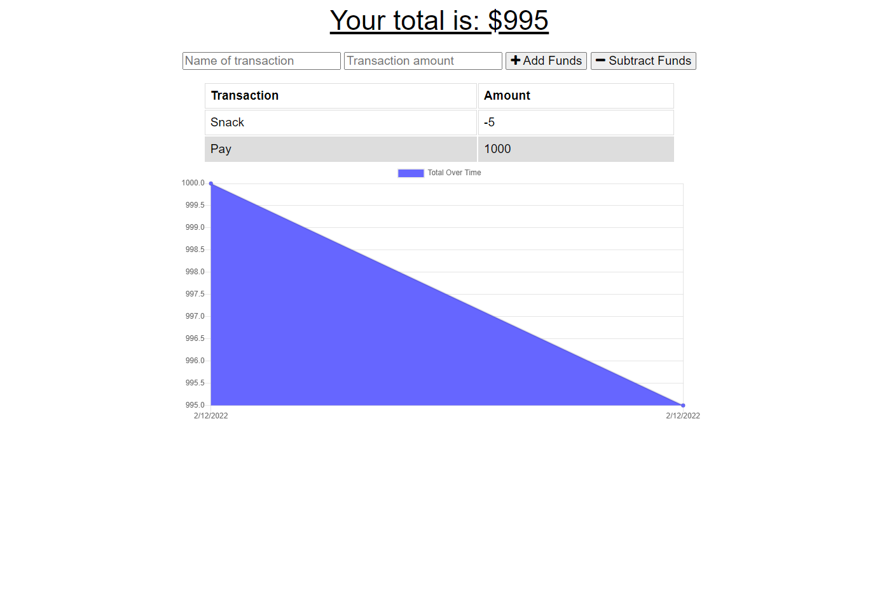

# Budget Tracker 

## Objective

As a user, I want to be able to track my withdrawals and deposits with or without a data/internet connection
so that my account balance is accurate when I am traveling and when I do receiver an internet connection, my balance is updated.

  ## Table of Contents 
- [Objective](#objective)
- [License](#license)
- [Description](#description)
- [Deployment](#deployment)
- [Questions](#questions)

## License

## Description

Budget Tracker is an application that allows the user to be able to add expenses and deposits to their budget with or without a connection. When entering transactions offline, they should populate the total when brought back online.

## Deployment

[Application is Deployed on Heroku](https://budget-tracker-ace.herokuapp.com/)

### Built With

* [HTML](https://developer.mozilla.org/en-US/docs/Web/HTML)
* [CSS](https://developer.mozilla.org/en-US/docs/Web/CSS)
* [Javascript](https://developer.mozilla.org/en-US/docs/Web/JavaScript)
* [Node.js](https://nodejs.org/en/)
* [Express](https://www.npmjs.com/package/express)
* [MongoDB](https://www.mongodb.com)

## Questions:

Have any questions?

Feel free to contact me at:
- Github: [OmarAce](https://github.com/OmarAce)
- Email: omarace95@gmail.com